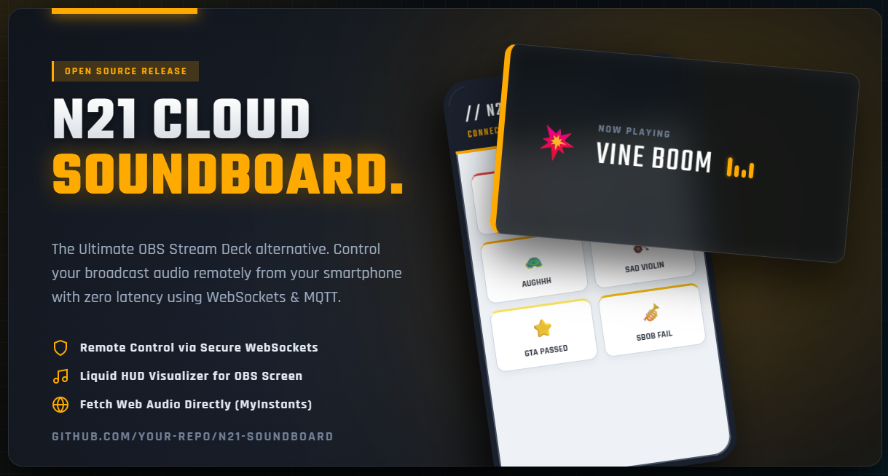

<div align="center">
  
# 🎙️ N21 Cloud Soundboard
**The Ultimate Web-Based OBS Stream Deck Alternative**

[](https://opensource.org/licenses/MIT)
[](https://reactjs.org/)
[](https://vitejs.dev/)
[](https://mqtt.org/)

*Transform your Smartphone into a professional, zero-latency Tactical Stream Deck.*

[**⬇️ Download & Fork Open Source**](#-open-source--modifications) • [**📖 How to Use**](#-tutorial-cara-penggunaan-lengkap)

---

 
> *(Preview Tampilan UI Controller & OBS HUD)*

</div>

<br>

## ✨ Tentang Project N21 Soundboard

**N21 Cloud Soundboard** adalah solusi open-source gratis bagi para *Live Streamer*, *Podcaster*, maupun pembuat konten yang ingin memiliki "Stream Deck" profesional (seperti Elgato) tanpa harus membeli hardware tambahan berharga jutaan rupiah. 

Aplikasi ini menggunakan perpaduan **React.js** dan teknologi **WebSockets MQTT**, memungkinkan PC OBS dan Smartphone-mu terhubung secara *Real-Time* (tanpa delay). Ditambah dengan visual **Liquid Glassmorphism** (kaca transparan) dan tema desain bernuansa taktis/militer PUBG!

### 🌟 Fitur Superior
- **📱 Smart Remote Controller**: Buka URL Controller di HP, dan sulap HP-mu jadi Tombol Efek Suara (Soundpad).
- **🌐 MyInstants Cloud Integration**: Suara bisa ditambahkan lewat *Link URL Website* (seperti `myinstants.com`) ataupun file MP3 lokal (`/assets`). Tidak perlu repot mendownload!
- **📺 OBS Liquid Glass Visualizer**: Terdapat "Pop-Up Notifikasi Kaca" beranimasi elastis (*bouncy*) bergaya Militer HUD yang akan muncul di layar streaming tiap kali suara ditekan, lengkap dengan gelombang suara (EQ) dan efek 3D Glowing.
- **⚙️ Tactical Command Center**: Halaman `Settings` yang mudah diakses untuk Mengedit, Menambah (CRUD), dan mengganti ikon/warna tombol efek suara mu di mana saja.
- **🌍 Bebas Jaringan Internasional**: Karena menggunakan Public MQTT Broker di jaringan internet, HP dan PC-mu tidak harus tersambung ke WiFi yang sama. Dari luar kota pun tetap bisa mengontrol OBS di rumah!

---

## 📖 Tutorial Cara Penggunaan Lengkap

Silahkan ikuti panduan *Step-by-Step* berikut untuk mulai menggunakan N21 Soundboard di Livestream Anda:

### Tahap 1: Persiapan Local Server (PC Streamer)
1. **Download Code**: *Clone* atau download *ZIP* dari repository ini ke komputer/PC Streaming kamu.
2. **Install NodeJS**: Pastikan komputermu sudah terinstall aplikasi NodeJS.
3. Buka folder dari project ini (*N21 Soundboard*) di aplikasi Terminal / Command Prompt.
4. Jalankan perintah instalasi (hanya di awal saja):
   ```bash
   npm install
   ```
5. Setelah selesai, jalankan Command untuk menghidupkan Server Lokal-nya:
   ```bash
   npm run dev -- --host
   ```
6. Akan muncul URL lokal (Contoh: `http://localhost:5173`) dan URL network (Contoh: `http://192.168.1.15:5173`). Biarkan *Terminal* / *Command Prompt* ini tetap terbuka selama kamu streaming!

### Tahap 2: Set-up OBS Studio (Overlay & Audio)
1. Buka browser (Chrome/Edge) di komputermu, masuk ke link: `http://localhost:5173`
2. Di layar awal (Landing Page), pilih menu **"BUAT ROOM PC (OBS HOST)"**.
3. Ketikkan nama ruangan yang kamu mau (contoh: `kamar-alex`) atau biarkan sistem mencetak kode acak. Klik **MULAI SEBAGAI OBS PLAYER**.
4. Akan muncul tulisan hijau "SYSTEM INITIALIZATION" di layar browser putih. *Berhasil!*
5. **PENTING**: *Copy URL lengkap yang ada di perambanmu*! (Contoh: `http://localhost:5173/player/kamar-alex`).
6. Buka program **OBS Studio**. Tambahkan *Source* baru jenis **Browser** (Browser Source).
7. Paste Link URL tadi ke isian `URL` di pengaturan OBS.
8. Atur resolusi Lebar (`Width: 1920`) dan Tinggi (`Height: 1080`).
9. **Ceklis** opsi *"Control audio via OBS"* (Agar suara Soundboard-nya bisa masuk ke *Audio Mixer* OBS). Dan tekan OK.
10. Tunggu beberapa detik, pop-up hologram status OBS akan menyala dan memudar transparan dengan sendirinya!

### Tahap 3: Sambungkan ke HP (Remote Deck)
1. Ambil HP / Tablet / iPad kamu.
2. Buka aplikasi Google Chrome / Safari.
3. Kunjungi URL Network IP komputermu yang tertulis saat Step 1.5, ATAU jika kamu sudah me-*Deploy* (meng-hosting) web ini di Vercel, kunjungi link Vercel-mu (misal: `https://n21-soundboard.vercel.app`).
4. Di *Landing Page*, pilih menu **"KONTROLER HP (REMOT)"**.
5. **Masukkan ROOM ID** yang persis sama dengan yang diketik di OBS tadi (contoh: `kamar-alex`).
6. Tekan KONEK. Akan muncul *Loading Screen System Initialization 3D* di HP mu.
7. 🎉 **DONE!** Grid Control Pad 32 Kotak Meme Suara akan tampil!. 
8. Coba sentuh/tap salah satu tombol suaranya (`Vine Boom`!), dan lihatlah pop-up overlay berbunyi dari OBS kamu! Mantap bukan?

> 💡 **TIPS Pengaturan Level**: Gunakan *Slider Bar Hitam* di bawah HP kamu untuk membersarkan / mengecilkan *Master Volume* secara *Real-Time*.

---

## 🛠 Cara Edit Suara Baru / Ganti Tombol
Jika bosan dengan daftar suara bawaan, silakan Modifikasi semaumu:
1. Di layar HP *Controller*, tekan tombol ikon Gigi Roda (`⚙️`) abu-abu berputar di kiri atas.
2. Kamu akan tiba di "SYSTEM CTRL" Mode (Menu Admin / Pengaturan).
3. Scroll ke bagian: **SOUND ASSETS DB**.
4. Klik tombol "Edit", maka kotak Lagu akan mengembang jadi form Input:
   - **Tombol / Nama**: Isi judul tombol.
   - **Warna & Icon**: Ubah warna bingkai dan *Emoji*-nya agar menarik!
   - **Audio Resource**: Di kotak ini tempel URL mentah berektensi Mp3 (Misalnya jika dari website MyInstants.com) Atau panggil nama audio kamu (`/assets/laguku.mp3`) asalkan file audionya sudah dimasukkan ke folder public aset kodingannya!
5. Jangan lupa klik tombol Biru "SAVE".

*(Jika HP atau Web mulai menumpuk sampahnya, pakailah tombol Merah *Factory Reset* paling bawah).*

---

## 🤝 Open Source & Modifications (Bebas Di Edit)

> *"Silakan copas, dibongkar, dipelajari, dicuri, dan dimodifikasi semaumu!"*

Project N21 Soundboard dikembangkan murni didedikasikan atas nama solidaritas konten kreator (Open Source by Nugra / N21). Jika kamu seorang *Web Developer* pemula atau jagoan IT; **Kamu dengan bebas dan berhak sepenuhnya atas Code kotor ini!**

Beberapa ide tambahan buat kamu yang ingin membongkar aplikasinya:
* Mengganti animasi Kaca Pecah (HTML CSS).
* Mengubah tata suara *Lounge / Anime Theme*.
* Merombak fungsi koneksi MQTT publik seperti "HiveMQ" agar memakai protokol Websocket pribadimu via NGINX.
* Menerjemahkan bahasa *Front-End* menu kontrolernya agar selaras dengan bahasa asing.

**Cara Kontribusi / Re-Upload Ke GitHub mu Sendiri:**
- Silahkan pencet tombol `Fork` di atas kanan Repository ini!
- Kamu bisa ubah CSS-nya di folder `/src/index.css`.
- Pengaturan inti database suara bisa dicegat di `/src/lib/useSettings.js` dan `/public/assets/sounds.json`.

Akhir kata perjuangan, GLHF dan Selamat Mencetak Konten Berkualitas! 🚀🔥
